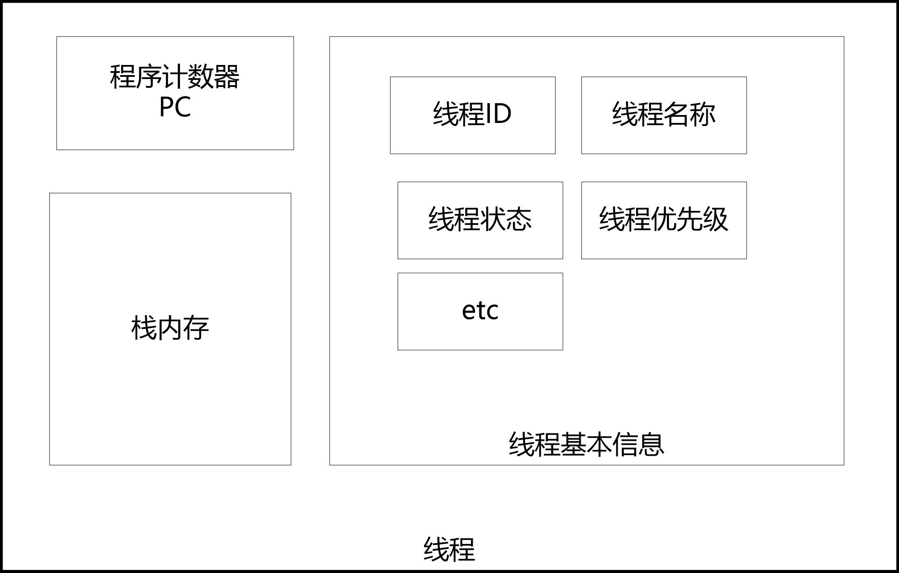
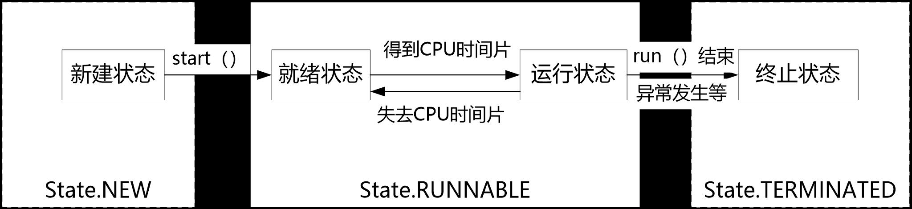
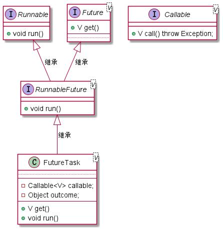

# 一、线程创建的3种方式
    进程与线程的区别：
    1）线程是“进程代码段”的一次的顺序执行流程。一个进程由一个或多个线程组成；一个进程至少有一个线程。
    2）线程是CPU调度的最小单位，进程是操作系统分配资源的最小单位。线程的划分尺度小于进程，使得多线程程序的并发性高。
    3）线程是出于高并发的调度诉求从进程内部演进而来的。线程的出现既充分发挥CPU的计算 性能，又弥补了进程调度过于笨重的问题。
    4）进程之间是相互独立的，但进程内部各个线程之间并不完全独立。各个线程之间共享进程的方法区内存、堆内存、系统资源（文件句柄、系统信号等）。
    5）切换速度不同，线程上下文切换比进程上下文切换要快得多。所以，有时线程也称为轻量级进程。

    线程是CPU调度的最小单位，一个进程可以有一个或者多个线程，各个线程时间共享进程的内存空间、系统资源
    一个线程主要由3部分组成:线程描述信息、程序计数器、栈内存

    1）线程ID（Thread ID，线程标识符）。线程的唯一标识，同一个进程内不同线程的ID不会重叠。
    2）线程名称。主要是方便用户识别，用户可以指定线程的名字，如果没有指定，系统就会自动分配一个名称。
    3）线程优先级。表示线程调度的优先级，优先级越高，获得CPU的执行机会就越大。
    4）线程状态。表示当前线程的执行状态，为新建、就绪、运行、阻塞、结束等状态中的一种。
    5）其他

    当前线程的执行状态，为新建、就绪、运行、阻塞、结束
    public static enum State {
    NEW, //新建
    RUNNABLE, //就绪、运行
    BLOCKED, //阻塞
    WAITING, //等待
    TIMED_WAITING, //计时等待
    TERMINATED; //结束
    }

# 1、创建线程的四种方式

a、继承 Thread 类创建线程类 Thread
    1）需要继承Thread类，创建一个新的线程类。
    2）同时重写run()方法，将需要并发执行的业务代码编写在run()方法中

b、Runnable
    1）定义一个新类实现Runnable接口。
    2）实现Runnable接口中的run()抽象方法，将线程代码逻辑存放在该run()实现版本中。
    3）通过Thread类创建线程对象，将Runnable实现类实例作为实际参数传递给Thread类的构造器，由Thread构造器将该Runnable实例赋值给自己的target执行目标属性。
    4）调用Thread实例的start()方法启动线程。
    5）线程启动之后，线程的run()将被JVM执行，该run()方法将调用到target属性的run()方法，从而完成Runnable实现类中业务代码逻辑的并发执行。

    public class CreateDemo2
    {
        public static final int MAX_TURN = 5;
        static int threadNo = 1;
        static class RunTarget implements Runnable //①实现Runnable接口
        {
            public void run() //②在这里编写业务逻辑
            {
                for (int j = 1; j < MAX_TURN; j++)
                {
                    Print.cfo(ThreadUtil.getCurThreadName() + ", 轮次：" + j);
                }
                Print.cfo(getCurThreadName() + " 运行结束.");
            }
        }
        public static void main(String args[]) throws InterruptedException
        {
            Thread thread = null;
            for (int i = 0; i < 2; i++)
            {
                Runnable target = new RunTarget();
                //通过Thread类创建线程对象，将Runnable实例作为实际参数传入
                thread = new Thread(target, "RunnableThread" + threadNo++);
                thread.start();
            }
        }
    }
 c、Callable、FutureTask
    1）创建一个Callable接口的实现类，并实现其call()方法，编写好异步执行的具体逻辑，可以有返回值。
    2）使用Callable实现类的实例构造一个FutureTask实例。
    3）使用FutureTask实例作为Thread构造器的target入参，构造新的Thread线程实例。
    4）调用Thread实例的start()方法启动新线程，启动新线程的run()方法并发执行。其内部的执行过程为：启动Thread实例的run()方法并发执行后，
        会执行FutureTask实例的run()方法，最终会并发执Callable实现类的call()方法。
    5）调用FutureTask对象的get()方法阻塞性地获得并发线程的执行结果。

    public class CreateDemo3 {
        public static final int MAX_TURN = 5;
        public static final int COMPUTE_TIMES = 100000000;
        //①创建一个Callable接口的实现类
        
        static class ReturnableTask implements Callable<Long> {
        //②编写好异步执行的具体逻辑，可以有返回值
        
            public Long call() throws Exception{
                long startTime = System.currentTimeMillis();
                Print.cfo(getCurThreadName() + " 线程运行开始.");
                Thread.sleep(1000);
                for (int i = 0; i < COMPUTE_TIMES; i++) {
                    int j = i * 10000;
                }
                long used = System.currentTimeMillis() - startTime;
                Print.cfo(getCurThreadName() + " 线程运行结束.");
                return used;
            }
        }

        public static void main(String args[]) throws InterruptedException {
            ReturnableTask task=new ReturnableTask();//③
            FutureTask<Long> futureTask = new FutureTask<Long>(task);//④
            Thread thread = new Thread(futureTask, "returnableThread");//⑤
            thread.start();//⑥
            Thread.sleep(500);
            Print.cfo(getCurThreadName() + " 让子弹飞一会儿.");
            Print.cfo(getCurThreadName() + " 做一点自己的事情.");
            for (int i = 0; i < COMPUTE_TIMES / 2; i++) {
                int j = i * 10000;
            }
            Print.cfo(getCurThreadName() + " 获取并发任务的执行结果.");
            try {
                Print.cfo(thread.getName()+"线程占用时间："+ futureTask.get());//⑦
            } catch (InterruptedException e) {
                e.printStackTrace();
            } catch (ExecutionException e) {
                e.printStackTrace();
            }
            Print.cfo(getCurThreadName() + " 运行结束.");
        }   
    }

d、线程池
    ExecutorService是Java提供的一个线程池接口，每次我们在异步执行target目标任务的时候，可
    以通过ExecutorService线程池实例去提交或者执行。ExecutorService实例负责对池中的线程进行管
    理和调度，并且可以有效控制最大并发线程数，提高系统资源的使用率，同时提供定时执行、定频
    执行、单线程、并发数控制等功能

    public class CreateDemo4
    {
        public static final int MAX_TURN = 5;
        public static final int COMPUTE_TIMES = 100000000;
        //创建一个包含三个线程的线程池
        
        private static ExecutorService pool = Executors.newFixedThreadPool(3);
        static class DemoThread implements Runnable
        {
            @Override
            public void run()
            {
                for (int j = 1; j < MAX_TURN; j++)
                {
                    Print.cfo(getCurThreadName() + ", 轮次：" + j);
                    sleepMilliSeconds(10);
                }
            }
        }

        static class ReturnableTask implements Callable<Long>
        {
            //返回并发执行的时间
            public Long call() throws Exception
            {
                long startTime = System.currentTimeMillis();
                Print.cfo(getCurThreadName() + " 线程运行开始.");
                for (int j = 1; j < MAX_TURN; j++)
                {
                    Print.cfo(getCurThreadName() + ", 轮次：" + j);
                    sleepMilliSeconds(10);
                }
                long used = System.currentTimeMillis() - startTime;
                Print.cfo(getCurThreadName() + " 线程运行结束.");
                return used;
            }
        }

        public static void main(String[] args) {
        pool.execute(new DemoThread()); // 执行线程实例，无返回

        pool.execute(new Runnable()
        {
            @Override
            public void run()
            {
                for (int j = 1; j < MAX_TURN; j++)
                {
                    Print.cfo(getCurThreadName() + ", 轮次：" + j);
                    sleepMilliSeconds(10);
                }
            }
        });

        //提交Callable 执行目标实例，有返回
        Future future = pool.submit(new ReturnableTask());
        Long result = (Long) future.get();
        Print.cfo("异步任务的执行结果为：" + result);
        sleepSeconds(Integer.MAX_VALUE);
        }
    }

    ExecutorService线程池的execute(...)与submit(...)方法的区别如下
    （1）接收的参数不一样
    （2）submit()有返回值，而execute()没有

